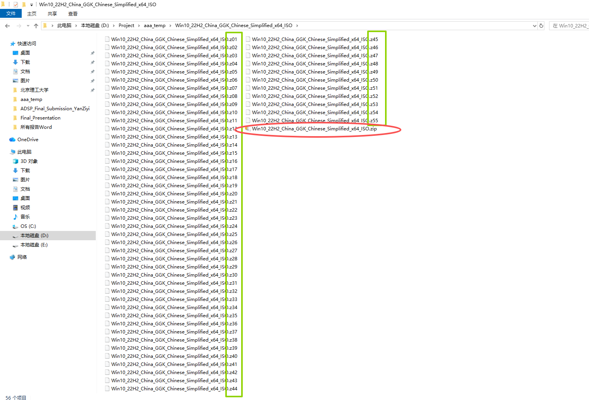
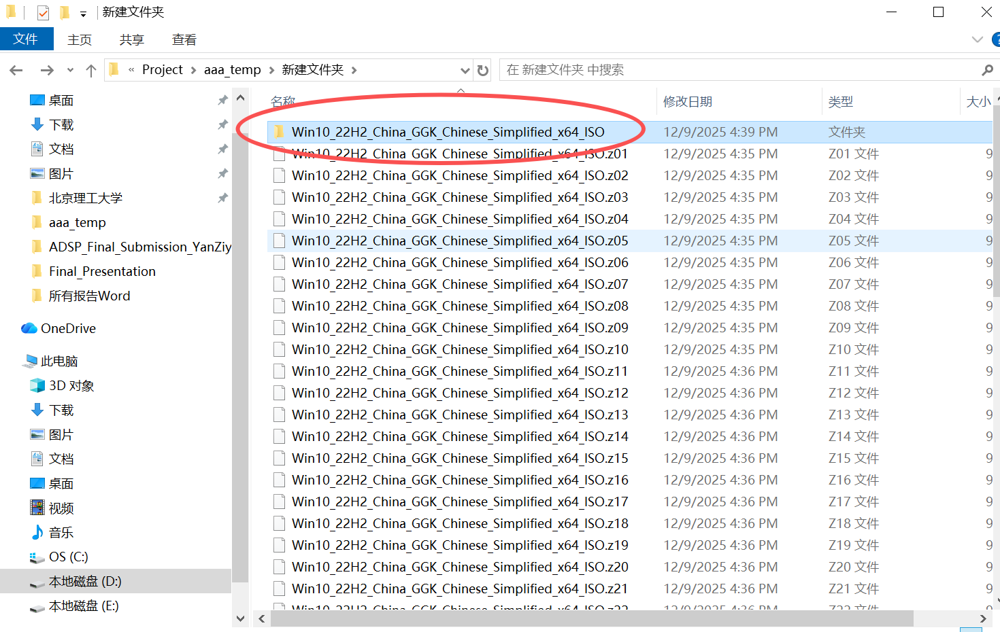
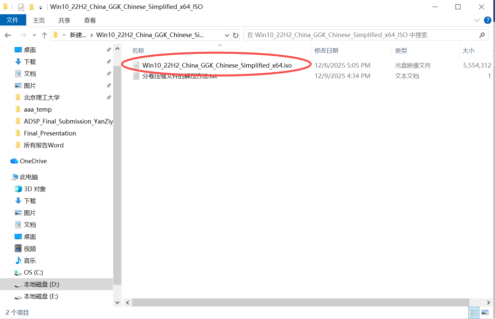

## Windows_10_22H2_Home_China_ISO_GCK_Chinese_Simplified_x64_ISO

Windows 10 Home China 22H2 ISO file. Win10家庭中文版ISO文件，单语言版，中文版，windows10家庭中文版。分卷压缩ISO文件,系统镜像，win10镜像，可直接装载安装，双击更新系统，无需U盘。Windows,win10iso,win10,iso，系统更新，windows更新，微软，Microsoft，22H2

如果你要用ISO文件直接双击升级windows，不用U盘，现在微软官网上win10只提供**多语言版**22H2的ISO文件，而中国大部分笔记本电脑预装的都是单语言版的windows10**家庭中文版**，这是**两个版本**。后者只能将中文作为显示语言，我查了一下这么分的原因好像是家庭中文版售价比多语音的国际版便宜，所以微软特地为大陆推出了这个版本。

所以直接用多语言版ISO装载然后运行Setup中间会让你输产品密钥，如果不想重新激活，延用之前预装的家庭中文版，就可以用这个网站下载windows10家庭中文版的ISO文件（截止2025/12/06还能用）

https://msdl.gravesoft.dev/#

进去后点击下载Windows 10 22H2 Home China (19045.2006) ```ID 2378```。
（这个方法比较推荐，应该比从Github下载要稳定和快得多）

---
当然，你也可以下载这个Github仓库里存储的ISO文件

因为整个ISO文件有5个GB多，GitHub上传单个文件大小限制是100MB，所以我用了分卷压缩，每个卷100MB，放在了```Win10_22H2_Home_China_ISO_Split_Archive```这个文件夹里。

最后的ISO文件应该是5,687,615,488字节，直接Download zip的话可能文件太大了不好下载，建议使用 git 的 SSH 进行仓库克隆。

### 分卷压缩文件解压方法
直接解压最后那个 Win10_22H2_China_GGK_Chinese_Simplified_x64_ISO.zip （注意后缀是.zip的文件只有一个） 就行；确保所有分卷（.z01–.z55）和 .zip 在同一文件夹且文件名未被改动，然后用 7‑Zip/WinRAR/Winzip或其他解压软件直接右键Win10_22H2_China_GGK_Chinese_Simplified_x64_ISO.zip ，解压到什么什么文件夹（就跟单个压缩包加压的流程一样）来提取内容。

流程展示如下：

克隆完仓库到本地后```Windows_10_22H2_Home_China_ISO_GCK_Chinese_Simplified_x64_ISO```这个文件夹里应该长这样，注意有一个.zip文件和.z01–.z55


右键.zip文件解压至文件夹


解压完成后会出现一个新的文件夹


点进去之后就会看到完整的ISO文件


你可以右键它属性看其大小是否为5.29 GB (5,687,615,488 字节)


### 解压得到ISO文件后按照以下微软官网的方法操作

https://www.microsoft.com/en-gb/software-download/windows10

https://www.microsoft.com/zh-cn/software-download/windows10

使用 ISO 文件安装 Windows 10 的其他方法（单击可显示详细或简要信息）

如果你下载了 Windows 10 的 ISO 文件，则该文件将在本地保存在你所选的位置。如果你的计算机上安装有你首选用来创建安装 DVD 的第三方 DVD 刻录程序，则可以转到该文件的保存位置，双击 ISO 文件来打开该程序，也可以右键单击 ISO 文件，选择打开方式，然后选择您的首选 DVD 刻录软件。

如果你要使用 Windows 磁盘映像刻录程序来创建安装 DVD，请转到 ISO 文件的保存位置。右键单击 ISO 文件，然后选择属性。在“常规”选项卡上，单击更改，在 Windows 资源管理器中，选择要用来打开 ISO 文件的程序，然后选择应用。此后，右键单击 ISO 文件，再选择刻录光盘映像。

如果你要从 ISO 文件直接安装 Windows 10，而不使用 DVD 或闪存驱动器，则可以通过装载 ISO 文件来执行此操作。此时，会将你当前的操作系统升级到 Windows 10。

若要装载 ISO 文件，请执行以下操作：

转到 ISO 文件的保存位置，右键单击 ISO 文件，然后选择属性。
在“常规”选项卡上，单击更改…，在 Windows 资源管理器中，选择要用来打开 ISO 文件的程序，然后选择应用。
右键单击 ISO 文件，然后选择装载。
双击 ISO 文件以查看其中的文件。双击 setup.exe，以启动 Windows 10 安装程序。
<br>
⭐⭐⭐

注意如果你想保留软件和文件，切记在点击setup.exe后有一步**一定要选择保留个人文件和应用**，虽然这是默认的。

我还附上了一个永久禁止windows更新的方法，在```Windows permanent update disable guide.txt```文件里，如果不想接收windows更新推送可以用。